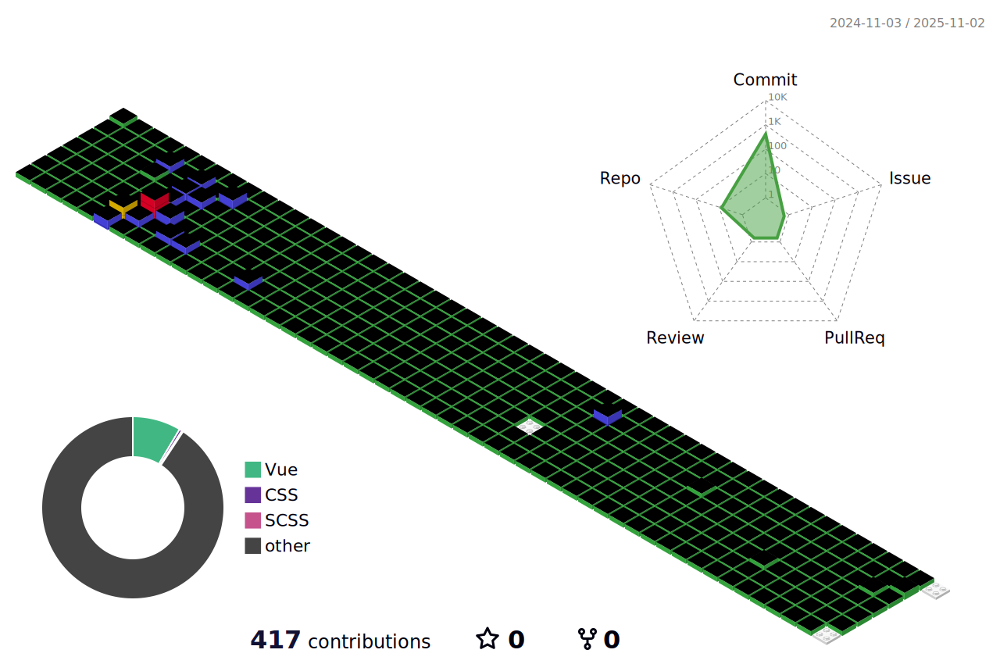

<!--  -->

 
 
 
 

## :sparkling_heart: Nice way to meet me :sparkling_heart:

   Hi there!  
   I'm a <strong>Front end developer.</strong>  
   I'm always open to your contacts so do not hesitate! :stuck_out_tongue_closed_eyes: 

 

## Contact 📞

  

 

## Skills 💪

#### Platforms & Languages

  
  

  

  
  
  
  
  

  
  
  

  
  
  

  
  

 

 
 

